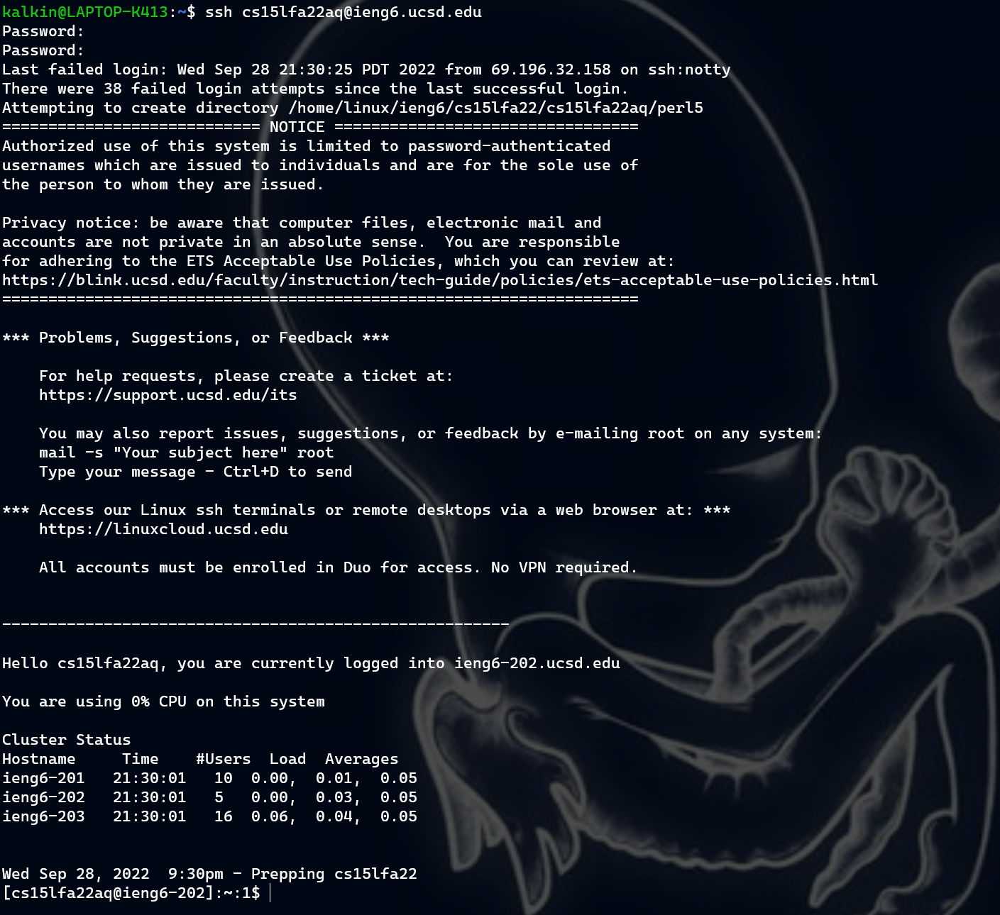

Remote access can be incredibly useful in various scenarios. Below are some examples:
- Access to a supercomputer/compute cluster
    - Great for training ML models!
- Isolating data - makes sure security isn't compromised
- OS Dependent software

## 1.  Installing VSCode
I didn't actually do this step. I had VSCode installed from a previous course. I'm pretty sure I just followed the steps [here](https://inst.eecs.berkeley.edu/~cs61a/su21/articles/vscode/).

This is what my VSCode setup looks like:


## 2. Remotely Connecting
Windows has native ssh now and I also have WSL installed so I didn't have to do any prior work to set up ssh compatibility. I got my course account [here](https://sdacs.ucsd.edu/~icc/index.php) and simply typed in `ssh cs15lfa22aq@ieng6.ucsd.edu` into my terminal. Then, I enter my password (which I had to reset) in order to log in. This works both on Windows (either command prompt, powershell, or git bash) and WSL.

* ### Ubuntu

- ### Git Bash

- ### Windows Powershell

- ### Command Prompt


This was the first time I was finally able to log in! There were a lot of issues with the password reset.

Only took 38 failed attempts and 4 hours of waiting 💀

The first time I tried to connect I saw a message saying
```⤇ ssh cs15lfa22aq@ieng6.ucsd.edu
The authenticity of host 'ieng6-202.ucsd.edu (128.54.70.227)' can't be established.
RSA key fingerprint is SHA256:ksruYwhnYH+sySHnHAtLUHngrPEyZTDl/1x99wUQcec.
Are you sure you want to continue connecting (yes/no/[fingerprint])? 
Password:
```
I simply just had to type `yes` and press enter.

## 3. Trying Some Commands
This is me trying some various commands. They functioned how I expected them to. It is interesting that I can attempt to access other people's accounts but thankfully it fails. I wonder if there is some overarching entity who monitors the files on my account.

To log out, i can type `exit` or Ctrl-D.


## 4. Moving Files With `scp`
To copy files from the client to a remote computer, I used `scp`

The file I used had the contents below:
```
class WhereAmI {
  public static void main(String[] args) {
    System.out.println(System.getProperty("os.name"));
    System.out.println(System.getProperty("user.name"));
    System.out.println(System.getProperty("user.home"));
    System.out.println(System.getProperty("user.dir"));
  }
}
```

Running the file using
```javac WhereAmI.java
java WhereAmI
```
I got the following result:


As you can see, I lied earlier! I really just ran `java WhereAmI.java` to run the file in one step instead of two.

To copy the file into the remote computer, i ran
```
scp WhereAmI.java cs15lfa22aq@ieng6.ucsd.edu:~/
```

## 5. Setting up an SSH Key

## 6. Optimizing Remote Running