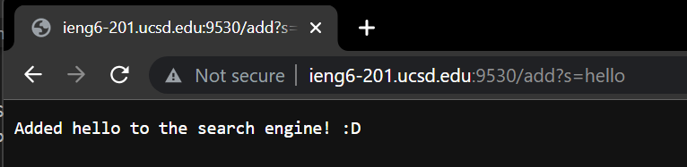

## Part One: Web Servers
For this part, I hosted a web server on ieng6 by running the following commands:
```
ssh cs15lfa22aq@ieng6.ucsd.edu
javac Server.java SearchEngine.java
java SearchEngine [port]
```
If I'm on ieng6-201, I can go to http://ieng6-201.ucsd.edu:9530/ to access my web server.

Note: It doesn't work if you aren't connected to UCSD-Protected or RESNET - Protected. There's a UCSD VPN that we otherwise.

 Below is the code for my simple search engine (also available in [this](https://github.com/kalkulator413/wavelet) github repo):
```
import java.io.IOException;
import java.net.URI;
import java.util.HashSet;

class Handler implements URLHandler {
    // The one bit of state on the server: a number that will be manipulated by
    // various requests.
    HashSet<String> words = new HashSet<>();

    public String handleRequest(URI url) {
        if (url.getPath().equals("/")) {
            return String.format("Welcome to my amazing search engine 8)\nGo to /add?s={word}" 
                + "to add a word\nUse /search?s={str} to return all words that contain str");     
        } else {
            // System.out.println("Path: " + url.getPath());
            if (url.getPath().contains("/add")) {
                String[] parameters = url.getQuery().split("=");
                if (parameters[0].equals("s")) {
                    if (!words.contains(parameters[1])) {
                        words.add(parameters[1]);
                        return String.format("Added %s to the search engine! :D", parameters[1]);
                    } else {
                        return String.format("The given string already exists :D");
                    }
                }
            } else if (url.getPath().contains("/search")) {
                String[] parameters = url.getQuery().split("=");
                if (parameters[0].equals("s")) {
                    String list = "";
                    for (String s : words) {
                        if (s.toLowerCase().contains(
                            parameters[1].toLowerCase()))
                            list += s + "\n";
                    }
                    return list;
                }
                return "";
            }
            return "404 Not Found!";
        }
    }
}

class SearchEngine {
    public static void main(String[] args) throws IOException {
        if(args.length == 0){
            System.out.println("Missing port number! Try any number between 1024 to 49151");
            return;
        }

        int port = Integer.parseInt(args[0]);

        Server.start(port, new Handler());
    }
}
```
The `handleRequest` method simply takes in the class path, query, and fragment and then interacts wiht the backing Set of all words.

This is the main page of the web server.


To add a word to the underlying HashSet, I can add `/add?s={word}` to the path.





You can't add repeats! The method that is called is `handleRequest` with path `/add?s=hi` or `/add?s=hello`. The HashSet in the class is modified since "hi" and "hello" are added to it. Previously, the HashSet was empty.

What happens behind the scenes is that we go into the if statement that checks for if the path contains `"/add"`. Then, we split the query at "=" and check that the first parameter is "s". If this is true, and the word is not already in the HashSet, then we can add the word into the HashSet. Otherwise, the HashSet is unmodified.

Here are some queries, which can be done by adding `/search?s={word}` to the path.


The method that is called is `handleRequest` with path `/search?s=hi` or `/search?s=h`. Nothing else in the class is modified, the values from the HashSet are simply retreived. The program compiles a list of all the words in the HashSet that contain "hi" in the first example and "h" in the second example. This isn't case sensitive!

What happens behind the scenes is that we go into the if statement that checks for if the path contains `"/search"`. Then, we split the query at "=" and check that the first parameter is "s". If this is true, then we iterate through the HashSet and concatenate all strings that contain the second parameter - the search term (this is not case sensitive). Otherwise, we simply return an empty string.

## Part Two: Debugging

For this part we used JUnit, which is a powerful tool for writing tests. It is a bit tedious to use from the terminal - I very much prefer to run JUnit tests from Intellij.

However, it is still important to know how to run JUnit tests from a terminal since we won't always have a powerful IDE (for example, on a remote server).

On linux, I can run the tests using the following commands:
```
javac -cp .:lib/hamcrest-core-1.3.jar:lib/junit-4.13.2.jar *.java
java -cp .:lib/hamcrest-core-1.3.jar:lib/junit-4.13.2.jar org.junit.runner.JUnitCore {TEST}
```

### First Bug

The first bug was located in the following code:


This test showcases the failure-inducing input - a list containing `{"a", "abcd", "adfsdf", "ab"}` and a StringChecker object that checks if each string has `length >= 2`.


The symptom is that the resulting list is `{"adfsdf", "abcd"}`.
The bug is that `result.add()` had an unecessary 0 passed in.

The bug caused the symptom because the first argument of `add()` specifies the index to add the element to; the elements were always added to the beginning of the list, making it reverse order.

Here is an image of the symptom.


### Second Bug

The second (and third) bug is in the following code:


This test case showcases the failure-inducing input - an array with the elements `{4, 3, 2, 1}`.


The symptom is that the resulting list is `{0, 0, 0, 0}`.
The bug is that the wrong array is modified and returned.

What is actually happening is that the values in the original array are being set to the values of a blank array. Java integer arrays are initialized with all zeroes, so essentially all the elements in the original array are being set to 0. Then, this array is being returned.

What we should be doing is modying the new array and returning that instead.

Here is an image of the symptom:


