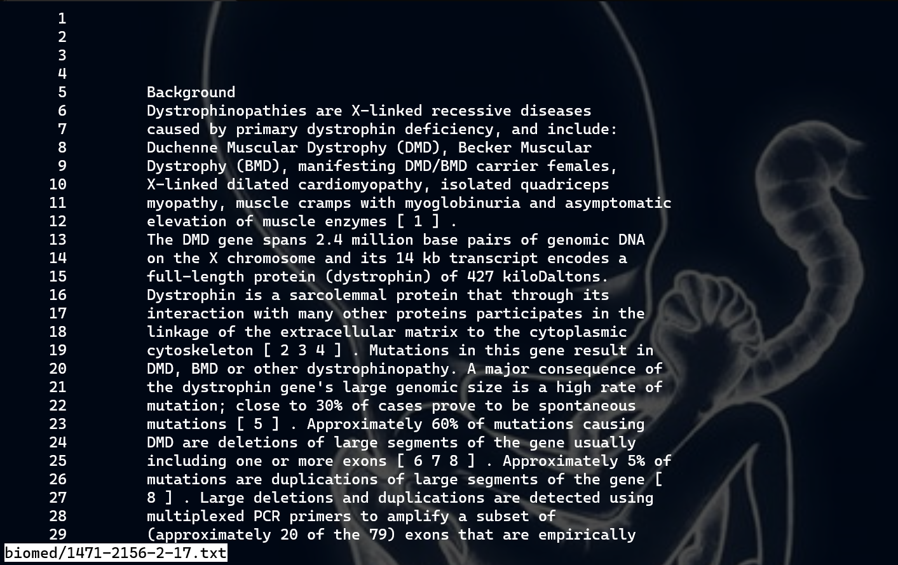
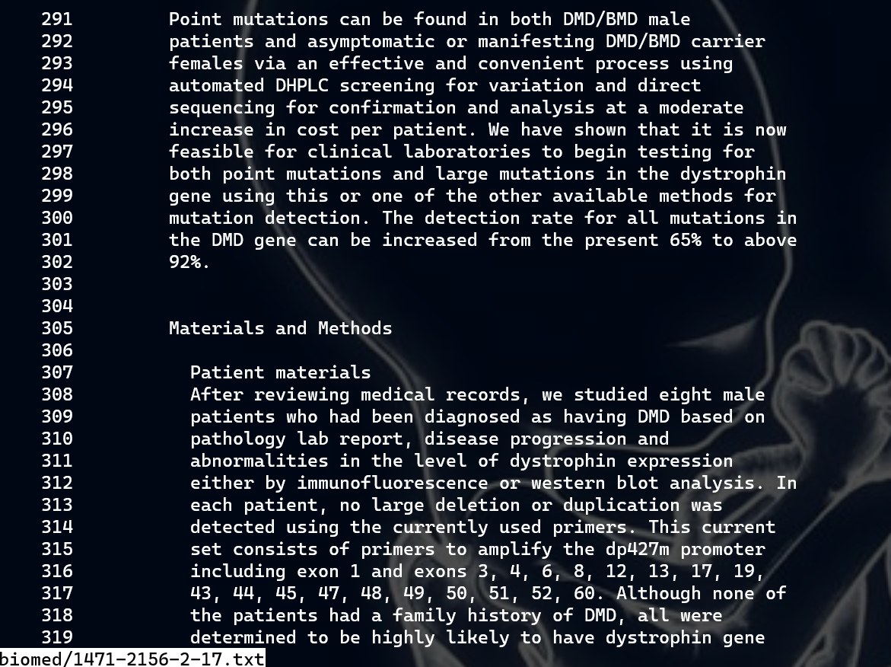
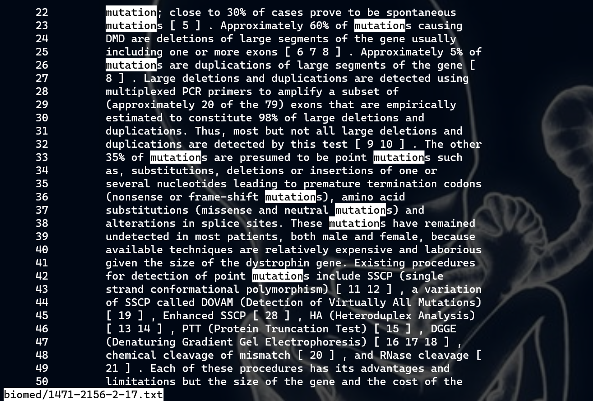
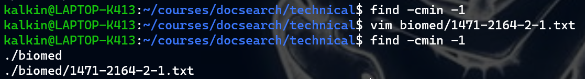
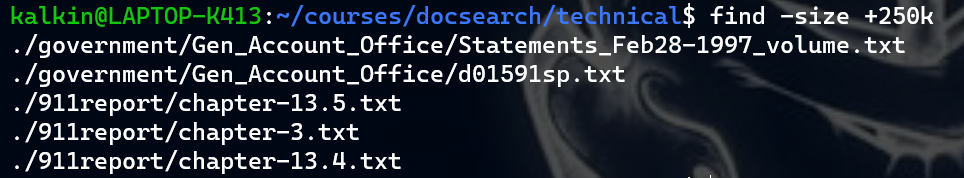
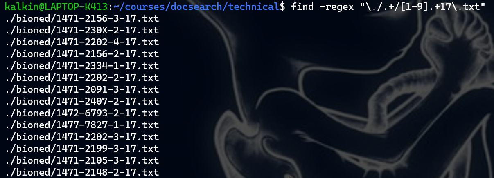
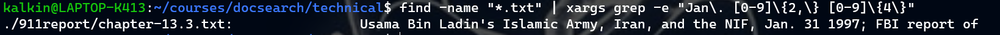
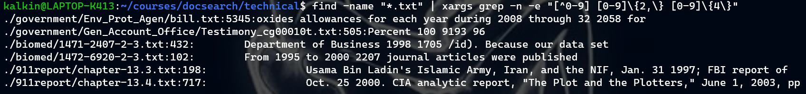
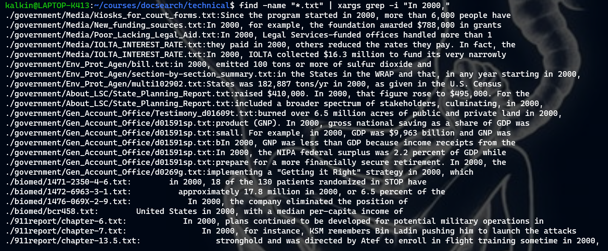

## Less
1. `less -N`

    This starts the less command but with each line being numbered. This is useful if you're editing a long file and you want to come back to a specific spot later. Instead of having to scroll through to find that spot, you can just remember the line number.

    
    

2. `less +[n] -j[N]`

    This command jumps to line `n` in the file positioned at the `Nth` line in the terminal. This is usefull because it can save some time scrolling if you already know where you want to go.

    
    

3. `less -p[pattern]`

    This command causes less to start at the first occurence of the patten. This is very useful if you are looking for a certain phrase in a file and you want to read the contents around that pattern; it saves some time from having to manually scroll through the file and look.

    
    

## Find
1. `find -cmin [time]`.
    
    This command shows all the files that have been changed in the specified amount of time, in minutes. This can be useful if you want to track your work and see everything you've changed in the last hour or so - especially useful if editing files that are not tracked by git!

    

2. `find -size +[low] -size -[high]`

    This command shows all the files within a certain size range. This can be very helpful if you want to locate huge files that are clogging up your storage and delete them!

    

3. `find -regex [pattern]`

    This command uses regex pattern matching to find files, which allows for a lot more options than simply expanding out stuff like "*.txt". For example, the example below shows all text files that start with a number and end with 17. Overall, regex allowes for much more customizable patterns.

    

## Grep
1. `grep -e [PATTERNS]`

    Similar to `find -regex`, this allows for much more options for pattern matching. It can be useful, for example, if I wanted to find all dates in the form Jan. DD YEAR.

    

2. `grep -n`

    This adds a line number to the start of each mached file. This can be useful if I want to find all lines containing a pattern in a directory, and then potentially navigate to those exact lines using some other command (like `less +N`).

    

3. `grep -i`

    This option allows for grep to ignore capitalization when looking for pattern matches. This is useful for words that ocassionaly show up at the start of a sentence, causing there to be varying capitalization.

    