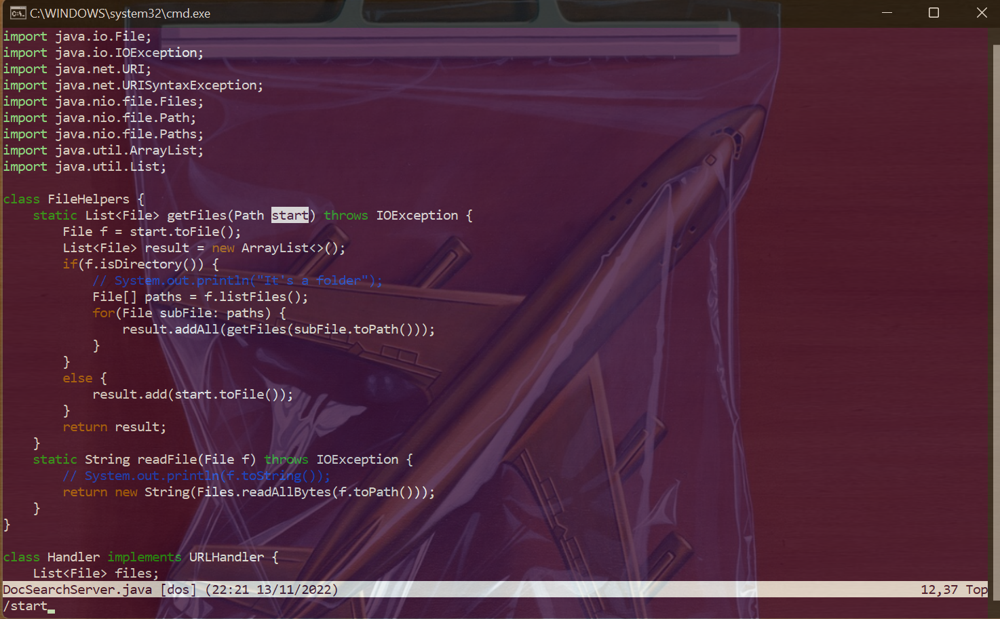
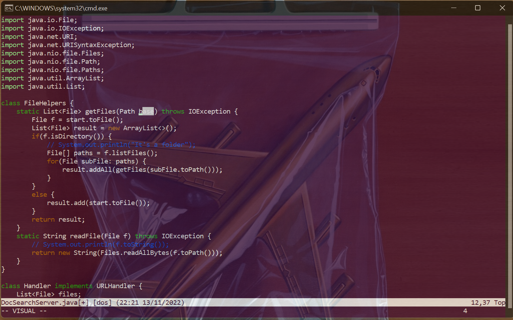
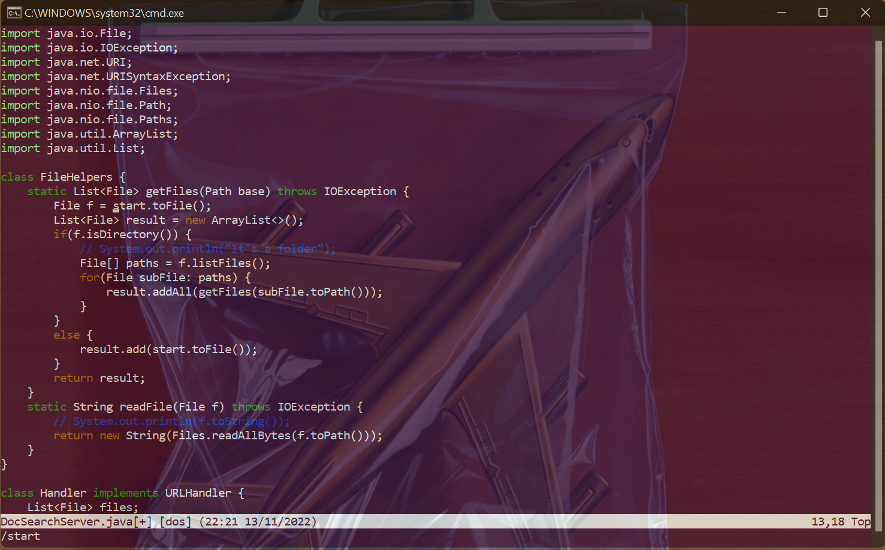
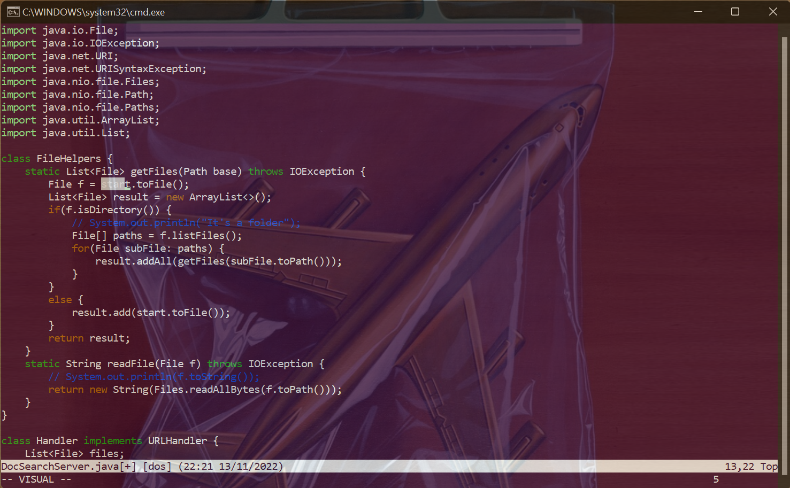
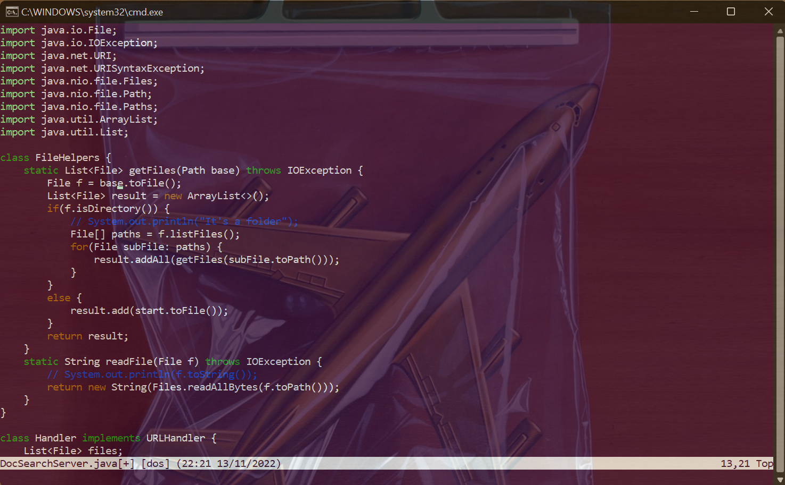

## Part One

- The task I chose to do was changing the name of the `start` parameter and all its uses to `base`.
- The entire sequence was `/star<Enter>cebase<Esc>vbynvepvbynvey:w<Enter>`. It's 30 characters, right at the max limit 😬😬😳

1. First, I used `/star<Enter>` to find the first instance of `start`. I skipped writing the 't' to save myself a character 😼

2. Then, I used `ce` to delete the word.

3. Then, i typed `base` where `start` used to be and did `<Esc>vb` to select all of `base`. I saved it to the clipboard by pressing `y`.

4. Then, I pressed `n` to get to the next instance of `start`.

5. Then, I used `ve` to select the word.

6. Then, I used `p` to paste in `base`, effectively replacing `start` with base. I also did `vby` to select `base` and save it to the clipboard again. It's slightly annoying that using `p` to replace the highlighted selection seems to copy what you highlighted...

7. I then did a similar procedure with the last instance of `start` that needed to be replaced. I pressed `n` to go to the word, `ve` to select it, and `y` to paste in `base` to replace it.

8. Finally, I did `:w<Enter>` to save the changes.

And we are done!

## Part Two

- When I edited the file on VSCode, used `scp` to copy it over, and ran `test.sh`, it took me 10.4 seconds. The hardest thing about this method is being patient with `scp`!
- When I started with an `ssh` session, edited the file in vim and ran it using `test.sh`, it took me 9.3 seconds. The hardest thing about this method is being comfotable with vim!

- If I was running something remotely, I would probably use VSCode or any IDE and `scp` it over, since having an IDE environment can be so useful. There's so many things I wouldn't catch if I didn't have an IDE to underline it for me.
- If it was a smaller task/a quick fix, I would probably use vim. It's pretty simple to quickly get stuff done on vim if you are comfortable with it, and you won't have to worry about waiting on `scp`.

The choice of method depends a lot on the task at hand!