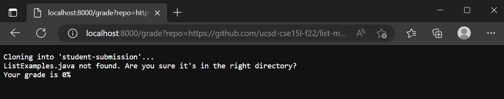
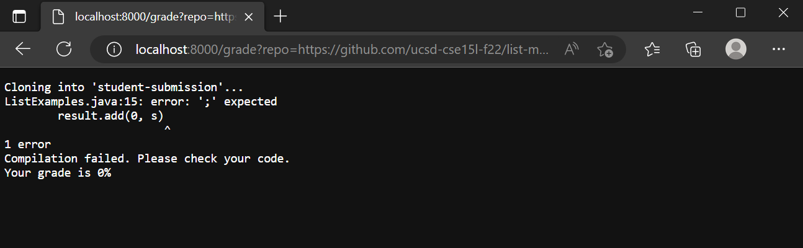
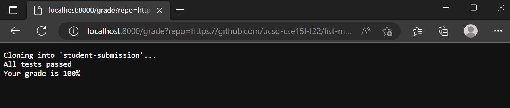

## Code:
```
# Create your grading script here

set -e

CPATHTESTS=".:../lib/hamcrest-core-1.3.jar:../lib/junit-4.13.2.jar"

rm -rf student-submission
git clone $1 student-submission

if [ -f "./student-submission/ListExamples.java" ]
then
    cp TestListExamples.java ./student-submission
    cd ./student-submission
    set +e
    javac -cp $CPATHTESTS *.java
    if [ $? -eq 0 ]
    then
        java -cp $CPATHTESTS org.junit.runner.JUnitCore TestListExamples > output.txt
        if [ $? -eq 0 ]
        then
            echo "All tests passed"
            echo Your grade is 100%
            exit 0
        fi
        t=$(grep -i "Tests run" output.txt)
        elements=$(echo $t | tr " " "\n")
        counter=0
        total=""
        passed=""
        for i in $elements
        do
            if [ $counter == 2 ]
            then
                total=${i%?}
            fi
            if [ $counter == 4 ]
            then
                passed=$i
            fi
            counter=$((counter+1))
        done
        if [ "$passed" != "" ]
        then
            echo You passed "$((total - passed))" / $total tests
            echo Your grade is "$((((total - passed)*100/total*100)/100))"%
        fi
    else
        echo Compilation failed. Please check your code.
        echo Your grade is 0%
    fi
else
    echo "ListExamples.java not found. Are you sure it's in the right directory?"
    echo Your grade is 0%
    exit 1
fi
```

## Student Submission Examples




## Code Tracing
Let's trace the code with the first student example, which is missing a file.

1. The first command `set -e` makes it so the script stops running in case of a failure. This is changed later on for certain things like compliation failures while running student code. The return code is 0 and there is no stderr or stdout.

2. `CPATHS` is a variable we store to make it easier to compile and run java files that use JUnit. The return code is 0 and there is no stderr or stdout.

3. The `rm -rf` command deletes any folder that might have been leftover from previously running the grading script on a student submission. The return code is 0 and there is no stderr or stdout.

4. `git clone` clones the student submission into a folder called `student-submission`. The return code is 0 and there is no stderr. The `stdout` for this command is `Cloning into 'student-submission'`

5. The if statement `if [ -f "./student-submission/ListExamples.java" ]`  evaluates to false, because the file "ListExamples.java" does not exist in the given path.

6. Lines 6-47 are not run since they are in the `then` block.

...

The following sequence of commands is executed because the file was missing.

48. The command `echo "ListExamples.java not found. Are you sure it's in the right directory?"` has an exit code of 0 and no stderr. The stdout is "ListExamples.java not found. Are you sure it's in the right directory?".
49. The command `echo Your grade is 0%` has an exit code of 0 and no stderr. The stdout is "Your grade is 0%".
50. The command `exit 1` has no stderr or stdout. The exit code is 1.